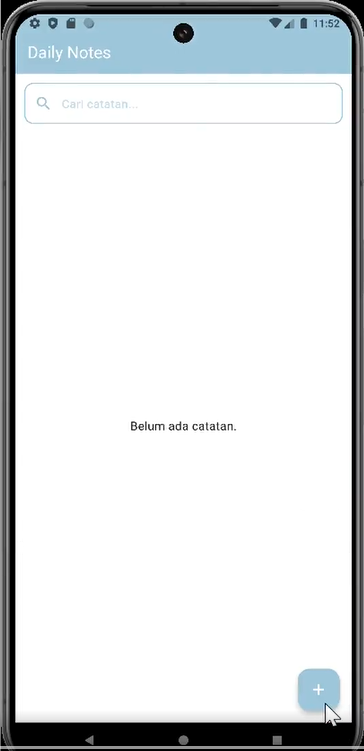
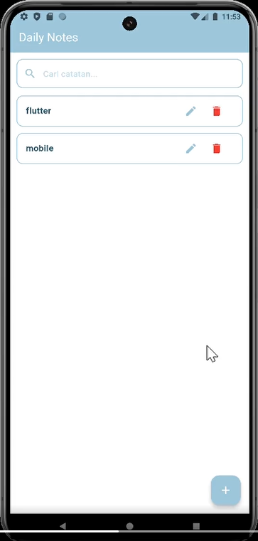
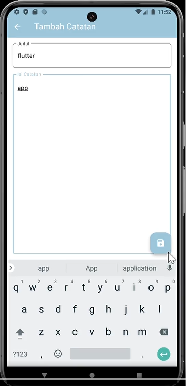
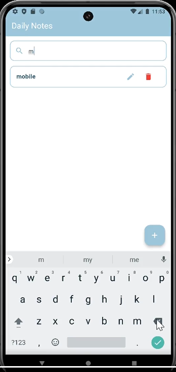

# 📝 Daily Notes - Flutter App

A minimalist note-taking mobile application built with Flutter, implementing MVVM architecture and Repository Pattern for clean and scalable code structure.

## ✨ Features

* 📝 Create, Read, Update, Delete (CRUD) notes
* 🔍 Search notes by title or content
* 📱 Minimalist UI inspired by iOS Notes
* 💾 Offline-first with SQLite
* 📄 Single detail page for Create, Read, and Update
* ⚡ Efficient state management using Provider

## 🛠️ Tech Stack

* Flutter
* SQLite
* Provider (State Management)
* MVVM Architecture
* Repository Pattern

## 📸 Preview
### Home Page

### Notes Page

### Add Note Page

### Search Page

## 💡 Architecture Overview

This project applies MVVM (Model-View-ViewModel) architecture combined with Repository Pattern to separate concerns and improve maintainability.

* Model → Data structure & database layer
* View → UI layer (Flutter Widgets)
* ViewModel → Business logic & state handling
* Repository → Data abstraction layer

## 📈 Future Improvements

* Cloud sync (Firebase)
* Dark mode
* Reminder & notification
* Export notes (PDF)

## 👩‍💻 Author

Made with ❤️ by nadaqqn
